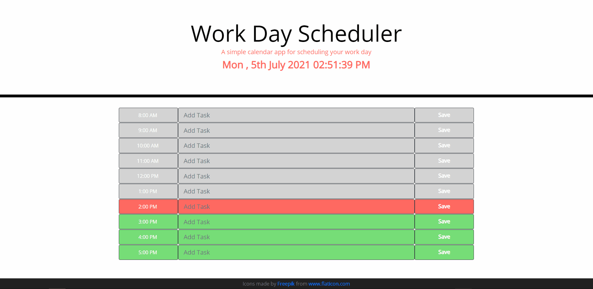

# Work Day Scheduler

## Day planner
A simple calendar application that allows a user to save events for each hour of the day. This app will run in the browser and feature dynamically updated HTML and CSS powered by jQuery. Boottrap and [Moment.js](https://momentjs.com/) are also used.

You can view the deployed Code Quiz App at this link. [Work Day Scheduler](https://mm-salvodragotta.github.io/work-day-scheduler/).

## Mock-Up

The following animation shows the web application's appearance and functionality:

- - -
© 2021. Confidential and Proprietary. All Rights Reserved.